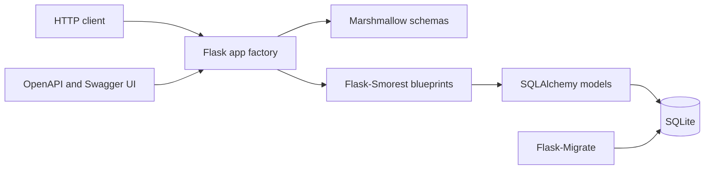
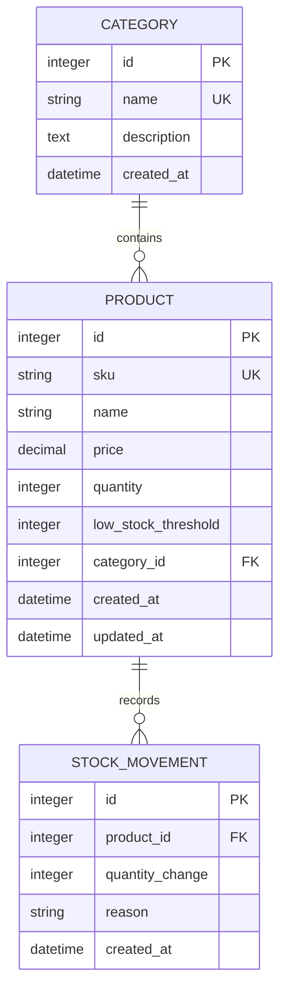
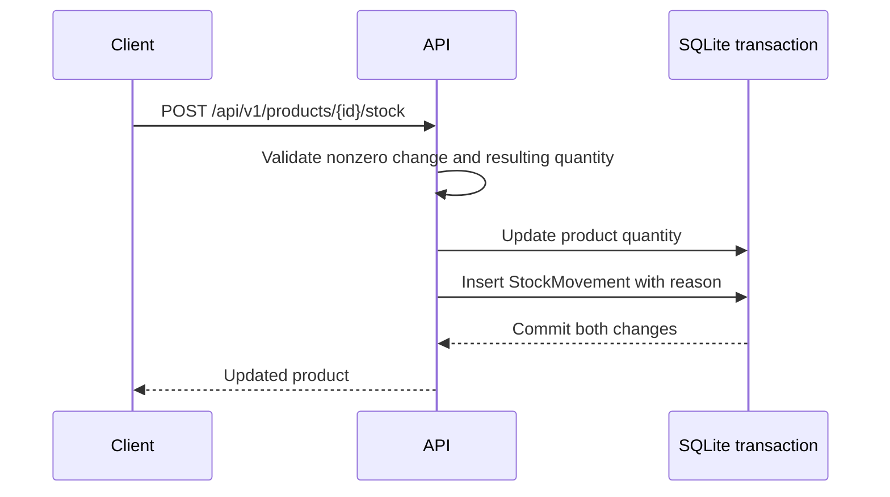
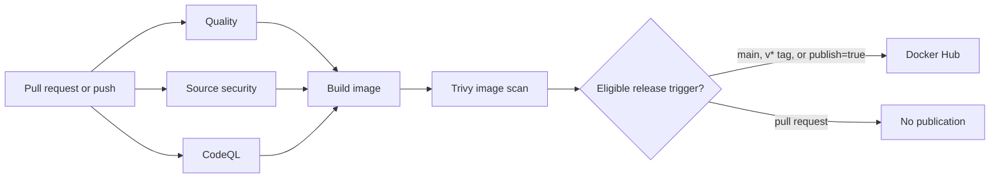

<div align="center">

# Inventory API

### A versioned Flask REST API for products, categories, stock adjustments, and auditable inventory history.


</div>

## Overview

I built this project to practice production-style API development instead of stopping at CRUD. It manages categories and products, exposes inventory search and pagination, and treats stock changes as auditable business events rather than a field that can be edited from anywhere.

The interesting part is the whole delivery path: an application factory, database migrations, isolated tests, OpenAPI documentation, a non-root Docker image, and GitHub Actions security gates before an image can reach Docker Hub.

Authentication and user ownership are intentionally outside the current scope.

## Features

### Application

- Category CRUD with unique names
- Product CRUD with unique SKUs
- Product search by name or SKU
- Category, price, low-stock, sorting, and pagination filters
- Stock additions and removals through a dedicated endpoint
- Immutable stock movement history, newest first
- Prevention of zero-value and negative-result stock adjustments
- Protection against deleting categories referenced by products
- Consistent JSON errors with application error codes and validation details
- Swagger UI and generated OpenAPI 3.0.3 documentation

### Engineering

- Flask application factory
- SQLAlchemy 2-style typed models
- Flask-Migrate/Alembic migration workflow
- Marshmallow request and response schemas
- Temporary SQLite files for tests
- Decimal prices serialized as strings instead of floating-point JSON values
- Runtime and development dependencies kept separate

### Delivery and security

- Python 3.12 Docker runtime
- Non-root container user
- Container health check
- GitHub Actions lint, test, migration, CodeQL, Bandit, pip-audit, and Trivy gates
- Docker image scanning for HIGH and CRITICAL vulnerabilities
- Docker Hub multi-architecture publication for `linux/amd64` and `linux/arm64`
- Build provenance and SBOM attestations
- Dependabot updates for Python packages, Docker, and GitHub Actions

## Tech Stack

| Layer | Technology |
|---|---|
| Language | Python 3.12+ |
| Web framework | Flask 3.1.3 |
| API contract | Flask-Smorest, Marshmallow, OpenAPI 3.0.3 |
| ORM and database | Flask-SQLAlchemy, SQLAlchemy, SQLite |
| Migrations | Flask-Migrate, Alembic |
| Application server | Gunicorn |
| Testing | Pytest |
| Quality | Ruff |
| Security analysis | Bandit, pip-audit, Trivy, CodeQL |
| Containerization | Docker, Docker Compose |
| CI/CD | GitHub Actions |
| Registry | Docker Hub |

## Architecture



| Component | Responsibility |
|---|---|
| `run.py` | Local entrypoint exposing the application object |
| `app/__init__.py` | Creates the Flask app and registers extensions and blueprints |
| `app/api/` | Health, category, product, stock, and movement endpoints |
| `app/schemas/` | Request validation and response serialization |
| `app/models/` | Database entities and persistence constraints |
| `app/extensions.py` | Shared SQLAlchemy, Alembic, and Flask-Smorest extension objects |
| `migrations/` | Versioned database schema changes |
| `tests/` | API integration tests using isolated temporary SQLite files |
| `.github/workflows/ci-cd.yml` | Quality, security, image build, and registry publication pipeline |

## Data Model



The database enforces unique category names and SKUs, nonnegative prices and quantities, and nonzero stock movement values. The API adds the business rule that a category with products cannot be deleted.

## How Stock Changes Work



The product quantity is intentionally absent from `ProductUpdateSchema`. Ordinary product edits cannot silently bypass the stock ledger. A successful adjustment updates the product and inserts its movement in the same transaction; a rejected adjustment creates neither a balance change nor a movement.

## Project Structure

```text
simple-flask-api/
├── app/
│   ├── api/
│   │   ├── categories.py
│   │   ├── health.py
│   │   └── products.py
│   ├── models/
│   │   ├── category.py
│   │   ├── product.py
│   │   └── stock_movement.py
│   ├── schemas/
│   │   ├── category.py
│   │   ├── product.py
│   │   └── stock_movement.py
│   ├── config.py
│   ├── errors.py
│   ├── extensions.py
│   └── __init__.py
├── migrations/
├── tests/
├── .github/
│   ├── dependabot.yml
│   └── workflows/ci-cd.yml
├── compose.yaml
├── Dockerfile
├── requirements.txt
├── requirements-dev.txt
└── run.py
```

## API Reference

The API is versioned under `/api/v1`. Swagger UI is available at `/docs`, and the OpenAPI document is available at `/openapi.json`.

### Health

| Method | Endpoint | Description |
|---|---|---|
| `GET` | `/api/v1/health` | Returns service health |

Response:

```json
{
  "status": "ok"
}
```

### Categories

| Method | Endpoint | Description |
|---|---|---|
| `POST` | `/api/v1/categories` | Create a category |
| `GET` | `/api/v1/categories` | List categories ordered by name |
| `GET` | `/api/v1/categories/{id}` | Read one category |
| `PATCH` | `/api/v1/categories/{id}` | Update a category |
| `DELETE` | `/api/v1/categories/{id}` | Delete an unused category |

Create request:

```json
{
  "name": "Peripherals",
  "description": "Computer accessories"
}
```

### Products

| Method | Endpoint | Description |
|---|---|---|
| `POST` | `/api/v1/products` | Create a product with initial quantity `0` |
| `GET` | `/api/v1/products` | Query products with filters and pagination |
| `GET` | `/api/v1/products/{id}` | Read one product |
| `PATCH` | `/api/v1/products/{id}` | Update product details, excluding quantity |
| `DELETE` | `/api/v1/products/{id}` | Delete a product |

Create request:

```json
{
  "sku": "KEY-001",
  "name": "Mechanical Keyboard",
  "price": "79.99",
  "category_id": 1,
  "low_stock_threshold": 5
}
```

Product queries support `search`, `category_id`, `min_price`, `max_price`, `low_stock`, `sort`, `page`, and `per_page`.

Examples:

```text
GET /api/v1/products?search=keyboard
GET /api/v1/products?category_id=1&low_stock=true
GET /api/v1/products?min_price=10&max_price=100&sort=-price
GET /api/v1/products?page=2&per_page=20
```

List responses have this shape:

```json
{
  "items": [
    {
      "id": 1,
      "sku": "KEY-001",
      "name": "Mechanical Keyboard",
      "price": "79.99",
      "quantity": 10,
      "low_stock_threshold": 5,
      "category_id": 1
    }
  ],
  "pagination": {
    "page": 1,
    "per_page": 20,
    "pages": 1,
    "total": 1
  }
}
```

### Stock and movement history

| Method | Endpoint | Description |
|---|---|---|
| `POST` | `/api/v1/products/{id}/stock` | Add or remove stock |
| `GET` | `/api/v1/products/{id}/movements` | Read newest-first movement history |

Adjustment request:

```json
{
  "quantity_change": -3,
  "reason": "Customer order"
}
```

Zero changes and adjustments that would make stock negative return `400`. Every successful adjustment records the signed change and reason.

### Errors

Errors follow one JSON format:

```json
{
  "error": {
    "code": "insufficient_stock",
    "message": "Stock cannot become negative.",
    "details": {}
  }
}
```

Validation failures include field-level details. Duplicate names and SKUs return `409`; missing resources return `404`; unsafe category deletion returns `409`.

## Getting Started

### Prerequisites

- Python 3.12 or newer
- Git, if obtaining the project from a repository
- Docker Desktop, if using the container workflow

### Local installation

Run these commands from the project root:

```powershell
python -m venv .venv
.venv\Scripts\Activate.ps1
python -m pip install -r requirements-dev.txt
```

The development database defaults to `instance/inventory.db`. To choose another database, set `DATABASE_URL`:

```powershell
$env:DATABASE_URL = "sqlite:///instance/inventory.db"
```

Apply the schema and start Flask:

```powershell
python -m flask --app run:app db upgrade
python run.py
```

The local API runs at `http://127.0.0.1:5000`. Open `http://127.0.0.1:5000/docs` for Swagger UI.

## Docker

Docker provides a reproducible Python 3.12 runtime and starts the service with Gunicorn. The container applies migrations before the server starts, runs as the unprivileged `app` user, and exposes port `8000`.

```powershell
docker compose up --build
```

The Compose service is available at `http://127.0.0.1:8000`. It stores SQLite data in the named `inventory-data` volume and sets:

```text
DATABASE_URL=sqlite:////data/inventory.db
```

The image health check calls `/api/v1/health` every 30 seconds after startup.

Stop the service:

```powershell
docker compose down
```

The named volume is retained by that command. Remove it only when intentionally discarding local inventory data.

## Testing and Quality

The test fixture creates a temporary SQLite database for each application fixture. Tests do not use or modify the development database.

Run the complete suite:

```powershell
pytest -q
```

Run a focused test:

```powershell
pytest tests/test_stock.py::test_stock_adjustments_create_newest_first_history -q
```

The CI quality job also runs:

```powershell
ruff check .
python -m flask --app run:app db upgrade
python -m flask --app run:app db check
```

## CI/CD



Workflow file: `.github/workflows/ci-cd.yml`.

The workflow runs for pull requests to `main`, pushes to `main`, `v*` tags, and manual dispatches. Before publication, it performs:

1. Ruff linting, Pytest, and migration drift validation.
2. `pip-audit` against runtime dependencies.
3. Bandit source analysis.
4. Trivy filesystem scanning for vulnerabilities, secrets, and misconfiguration.
5. GitHub CodeQL analysis with the `security-extended` query set.
6. Docker image build and Trivy HIGH/CRITICAL vulnerability scanning.

Only then does the publish job log in to Docker Hub and build/push `linux/amd64` and `linux/arm64` images with BuildKit provenance and an SBOM.

### Docker Hub configuration

Add these repository secrets in GitHub:

| Secret | Purpose |
|---|---|
| `DOCKERHUB_USERNAME` | Docker Hub account or organization name |
| `DOCKERHUB_TOKEN` | Docker Hub access token with push permission |

The image name is `${DOCKERHUB_USERNAME}/simple-flask-api`.

Images receive these tags:

- Push to `main`: `latest`, `main`, and `sha-<commit>`
- Push of `v1.2.3`: `1.2.3`, `1.2`, and `sha-<commit>`

Pull requests never receive Docker Hub credentials and never publish images. Dependabot checks Python dependencies, Docker, and GitHub Actions weekly.

## Security Boundaries

Implemented controls include:

- Input validation through Marshmallow schemas
- Database-level uniqueness and nonnegative-value constraints
- Transactional stock and movement writes
- Secrets supplied through GitHub Actions secrets rather than committed files
- Dependency auditing with `pip-audit`
- Python security scanning with Bandit
- Repository and container scanning with Trivy
- CodeQL analysis
- Non-root Docker runtime
- Docker Hub publication gated by all previous security jobs

There is no authentication, authorization, rate limiting, or user ownership model in this version. The API is designed for the stated inventory-management scope, not as a publicly exposed multi-tenant service.

## Engineering Decisions

### Why an application factory?

`create_app()` keeps extension setup and blueprint registration explicit, while tests can create an application against a temporary SQLite database without touching the development database.

### Why keep quantity out of product updates?

Inventory is an auditable business process. A dedicated stock endpoint makes the balance change and its reason visible in code and ensures each successful change produces a movement record.

### Why SQLite?

SQLite keeps local setup and CI lightweight for this project. The database URL is configurable, so the persistence boundary is not hard-coded into the API implementation.

### Why validate migrations in CI?

The workflow upgrades a clean database and then runs Alembic's drift check. A model change without a matching migration should fail before an image is published.

### Why publish only after image scanning?

The release job depends on application quality, source security, CodeQL, and image security jobs. This keeps the registry from becoming the first place a vulnerable artifact is discovered.

## Challenges and Solutions

### Keeping stock changes auditable

The simple approach would expose `quantity` in every product update. That makes it easy to lose the reason for a change and bypass history. The implementation instead uses a dedicated adjustment route, validates the resulting balance, and commits the product update with a `StockMovement`.

### Keeping CI security checks actionable

Security checks are separate jobs rather than one large script. This makes a failing dependency audit, source scan, CodeQL result, or image scan visible as its own pipeline signal, while the image build waits for the earlier gates.

### Keeping tests away from development data

The test fixture creates a database under Pytest's temporary directory and creates/drops its schema around the fixture. This makes the suite safe to run repeatedly during local development and in CI.

## What I Learned

The biggest lesson was that building the API was only one part of the work. The more valuable engineering exercise was making the behavior reproducible: migrations, isolated tests, a minimal runtime image, health checks, security scanning, provenance, and a release path that refuses to publish when an earlier gate fails.

## Roadmap

- [x] Versioned inventory API
- [x] Categories and products
- [x] Transactional stock adjustments and movement history
- [x] Product filtering and pagination
- [x] OpenAPI and Swagger UI
- [x] SQLite migrations
- [x] Isolated API tests
- [x] Docker Compose runtime
- [x] GitHub Actions CI/CD and security gates
- [x] Docker Hub multi-architecture publication workflow
- [ ] Authentication and authorization
- [ ] PostgreSQL deployment configuration
- [ ] Kubernetes or infrastructure-as-code deployment
- [ ] Metrics, tracing, and centralized logging

The unchecked items are not implemented in this repository.

## 🤖 AI-Assisted Development

AI was part of the development workflow for this project. I used it for planning, implementation scaffolding, debugging, test design, CI/CD design, and documentation drafting.

The generated work was reviewed against the repository, executed through the test and security checks, and adjusted where the actual framework behavior differed from the initial implementation. The final architecture, constraints, verification choices, and release policy are engineering decisions reflected in the code and workflow.

## About This Project

This repository is a hands-on exercise in turning a small REST API into a complete, reproducible software workflow: model the domain carefully, expose a documented contract, test the important invariants, package the runtime, scan the artifact, and automate release only after the gates pass.

> Build it. Break it. Understand it. Automate it.
